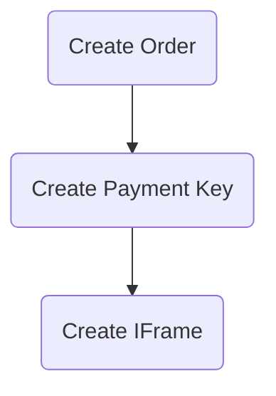
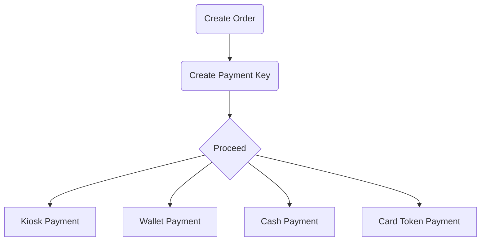

# 1- Requirements

Before starting to use Accept APIs it needs to be configured with your account's secret keys which is
available in your [Accept Dashboard][accept-dashboard]. in `.env` Set the following variables:
```
ACCEPT_API_KEY=<YOUR API KEY>
ACCEPT_HMAC_SECRET=<YOUR HMAC SECRET>
```

After setting up your secret keys, now you will be able to use Accept API interfaces.


# 2- Payment Flow

Payment Flow for [IFrame](#53-create-iframe-url) Payment


Payment Flow for `Kiosk`, `Wallet`, `Cash`, and `Card Token` Payment



### 2.1 [Payment Flow Full Examples](/docs/services/accept_payment_flow.md)

-----

# 3- APIs

## 3.1 Initialize `AcceptAPIClient`

```python
from paymob.accept import AcceptAPIClient

accept_api_client = AcceptAPIClient()
```

by initializing an object from `AcceptAPIClient` a TCP connection session is established with Paymob server and an `Auth Token` is automatically retrieved.

## 3.2 Create Order

You will register an order to Accept's database, so that you can pay for it later using a transaction.
Order ID will be the identifier that you will use to link the transaction(s) performed to your system, as one order can have more than one transaction.


**Parameters**

| Parameter | Required? | Default | Description |
| --- | --- | --- | --- |
| `merchant_order_id` | `Yes` | - |  Your Internal Order ID |
| `amount_cents` | `Yes` | - |  The price of the order in cents. |
| `currency` | `Yes` | - |  The currency related to this payment |
| `delivery_needed` | `No` | `False` | Set it to be true if your order needs to be delivered by Accept's product delivery services |
| `items` | `No` | `list` |  list of objects contains the contents of the order if it is existing, send it as empty array if it is not available. However, Mandatory for Souhoula and GET_GO payment methods |
| `shipping_data` | `No` | `dict` |  Mandatory if your order needs to be delivered, otherwise you can delete the whole object |
| `shipping_details` | `No` | `dict` |  Mandatory if your order needs to be delivered, otherwise you can delete the whole object |


**Example**

```python
from paymob.accept import AcceptAPIClient
from paymob.accept.utils import AcceptUtils

accept_api_client = AcceptAPIClient()

mid_key = "<Type>" # MidKey is useful if you support multiple types of items.
identifier = "<Internal Order ID>"
merchant_order_id = AcceptUtils.generate_merchant_order_id(mid_key=mid_key, identifier=identifier)
amount_cents = 1000
currency = "EGP"

code, order, feedback = accept_api_client.create_order(
    merchant_order_id=merchant_order_id,
    amount_cents=amount_cents,
    currency=currency
)
```

## 3.3 Get Order

Retrieves order data.

**Parameters**

| Parameter | Required? | Default | Description |
| --- | --- | --- | --- |
| `order_id` | `Yes` | - | Order ID retrieved from [Create Order API](#32-create-order) |


**Example**

```python
from paymob.accept import AcceptAPIClient

accept_api_client = AcceptAPIClient()

order_id = "<Paymob Order Id>"
integration_id = "<Your Integration ID>"
code, order, feedback = accept_api_client.get_order(
    order_id=order_id,
)
```

## 3.4 Create Payment Key

At this step, you will obtain a payment_key token. This key will be used to authenticate your payment request. It will be also used for verifying your transaction request metadata.


**Parameters**

| Parameter | Required? | Default | Description |
| --- | --- | --- | --- |
| `order_id` | `Yes` | - | Order ID retrieved from [Create Order API](#32-create-order) |
| `amount_cents` | `Yes` | - | The price should be paid through this payment channel with this payment key token |
| `currency` | `Yes` | - | The currency related to this payment |
| `billing_data` | `Yes` | `dict` | The billing data related to the customer related to this payment |
| `integration_id` | `Yes` | `False` | An identifier for the payment channel you want your customer to pay through |
| `card_token_key` | `No` | `str` | Card Token received from token callback if the user choices to save his card information for future payment |
| `expiration` | `No` | `int` | The expiration time of this payment token in seconds. (The maximum is 3600 seconds which is an hour) |
| `lock_order_when_paid` | `No` | `False` | A flag prevent this order to be paid again if it is paid |


**Example**

```python
from paymob.accept import AcceptAPIClient

accept_api_client = AcceptAPIClient()

order_id = "<order_id>"
amount_cents = 1000
currency = "EGP"
billing_data = {}
integration_id = "<Your Integration ID>"
code, payment_key, feedback = accept_api_client.create_payment_key(
    order_id=order_id,
    amount_cents=amount_cents,
    currency=currency,
    billing_data=billing_data,
    integration_id=integration_id,
)
# NOTE: payment_key is str NOT Object like other APIs

```


## 3.5 Wallet Payment

After creating the payment key, you may need to processed to `Mobile Wallets` payment, so you need to use the following API to get the `redirect URL`.


**Parameters**

| Parameter | Required? | Default | Description |
| --- | --- | --- | --- |
| `payment_key` | `Yes` | - | Payment Key obtained from [Create Payment Key](#34-create-payment-key) |
| `identifier` | `Yes` | - | Wallet Mobile Number |


**Example**

```python
from paymob.accept import AcceptAPIClient

accept_api_client = AcceptAPIClient()

payment_key = "<Payment Key>"
identifier = "<Wallet Mobile Number>"
code, transaction, feedback = accept_api_client.proceed_wallet_payment(
    payment_key=payment_key,
    identifier=identifier
)
print(f"Redirect URL: {transaction.redirect_url}")
```


Output:
```bash
Redirect URL: https://accept.paymob.com/****
```


## 3.6 Kiosk Payment

After creating the payment key, you may need to processed to `Kiosk` payment, so you need to use the following API to get the `bill_reference`.

**Parameters**

| Parameter | Required? | Description |
| --- | --- | --- |
| `payment_key` | `Yes` | Payment Key obtained from [Create Payment Key](#34-create-payment-key) |


**Example**

```python
from paymob.accept import AcceptAPIClient

accept_api_client = AcceptAPIClient()

payment_key = "<Payment Key>"
code, transaction, feedback = accept_api_client.proceed_kiosk_payment(
    payment_key=payment_key,
)
print(f"Bill Reference: {transaction.data.bill_reference}")
```

Output:
```bash
Bill Reference: 123456789
```

## 3.6 CASH Payment

After creating the payment key, you may need to processed to `Cash` payment, so you need to use the following API


**Parameters**

| Parameter | Required? | Description |
| --- | --- | --- |
| `payment_key` | `Yes` | Payment Key obtained from [Create Payment Key](#34-create-payment-key) |

**Example**

```python
from paymob.accept import AcceptAPIClient

accept_api_client = AcceptAPIClient()

payment_key = "<Payment Key>"
code, transaction, feedback = accept_api_client.proceed_cash_payment(
    payment_key=payment_key,
)
```


## 3.7 Card Token Payment

**Prerequisites:** Please ask your technical contact for a recurring payment setup, you should receive extra integration ID in your dashboard.

Now you've received your customer's card token, in order to perform recurring payments with this token, use the following API:


**Parameters**

| Parameter | Required? | Description |
| --- | --- | --- |
| `payment_key` | `Yes` | Payment Key obtained from [Create Payment Key](#34-create-payment-key) |
| `card_token` | `Yes` | Card Token tou received in the card token callback |


**Example**

```python
from paymob.accept import AcceptAPIClient

accept_api_client = AcceptAPIClient()

payment_key = "<Payment Key>"
code, transaction, feedback = accept_api_client.proceed_card_token_payment(
    payment_key=payment_key,
    card_token=card_token
)
```

## 3.8 Create Invoice Link

Use this API in case you need to generate invoice links using an API instead of generating it from your Accept dashboard.


**Parameters**

| Parameter | Required? | Default | Description |
| --- | --- | --- | --- |
| `amount_cents` | `Yes` | - | The amount in cents to be paid for in the invoice |
| `shipping_data` | `Yes` | - | The details of the customer or end-user |
| `items` | `Yes` | - | It will include the details of the order. |
| `currency` | `Yes` | - | The currency used in the invoice. By default, it will be EGP. |
| `integrations` | `Yes` | - | The payment methods that will be listed in the invoice link. You should enter the integration ID of every payment method |
| `delivery_needed` | `No` | `False` | Determines if you use our delivery. By default, it will be "false" |

**Example**

```python
from paymob.accept import AcceptAPIClient

accept_api_client = AcceptAPIClient()

amount_cents = "1000"
shipping_data = {
    "first_name":"Test",
    "last_name":"Account",
    "phone_number":"01010101010",
    "email":"test@account.com"
}
items = [
    {
    "name":"ASC1525",
    "amount_cents":"4000",
    "quantity":"1",
    "description":"Smart Watch"
    }

]
currency = "EGP
integrations = [11, 22, 33]
code, invoice, feedback = accept_api_client.create_invoice_link(
    amount_cents=amount_cents,
    shipping_data=shipping_data,
    items=items,
    currency=currency,
    integrations=integrations,
)
print(f"Invoice ID: {invoice.id}")
print(f"Invlice URL: {invoice.url}")
```

**Output**:
```bash
Invoice ID: 1122
Invlice URL: https://accept.paymob.com/****
```


## 3.9 Create Product Link

Use this API in case you need to generate product links using an API instead of generating it from your Accept dashboard.


**Parameters**

| Parameter | Required? | Default | Description |
| --- | --- | --- | --- |
| `product_name` | `Yes` | - | The name of your product |
| `product_description` | `Yes` | - | The description of your product |
| `amount_cents` | `Yes` | - | The amount in cents to be paid for in the product |
| `currency` | `Yes` | - | The currency used in the product. By default, it will be EGP. |
| `integrations` | `Yes` | - | The payment methods that will be listed in the product link. You should enter the integration ID of every payment method |
| `allow_quantity_edit` | `No` | `False` | If the stock will be reduced when a product is paid for |
| `delivery_needed` | `No` | `False` | Determines if you use our delivery. By default, it will be "false" |


**Example**

```python
from paymob.accept import AcceptAPIClient

accept_api_client = AcceptAPIClient()

product_name = "iPhone"
product_description = "Description"
amount_cents = "1000"
currency = "EGP
integrations = [11, 22, 33]
inventory = "1"
code, product, feedback = accept_api_client.create_product_link(
    product_name=product_name,
    product_description=product_description,
    amount_cents=amount_cents,
    currency=currency,
    inventory=inventory,
    integrations=integrations,
)
print(f"Product ID: {product.id}")
print(f"Product URL: {product.product_url}")
```

**Output**:
```bash
Product ID: 1122
Product URL: https://accept.paymob.com/****
```


## 3.10 Transaction APIs

Use this APIs to `Retrieve`, `Auth`, `Capture`, `Void`, or `Refund` a Transaction.

### 3.10.1 Retrieve a Transaction

1- If you want to inquire with the transaction "ID" use the following API:


**Parameters**

| Parameter | Required? | Description |
| --- | --- | --- |
| `transaction_id` | `Yes` | Transaction ID you received in the transaction callback |


**Example:**
```python
from paymob.accept import AcceptAPIClient

accept_api_client = AcceptAPIClient()

transaction_id = 1
code, transaction, feedback = accept_api_client.get_transaction(
    transaction_id=transaction_id
)

print(f"Code: {code}")
print(f"Transaction: {transaction}")
print(f"Transaction ID: {transaction.id}")
print(f"Feedback Message: {feedback.message}")
print(f"Feedback Status Code: {feedback.status_code}")
```

Output:
```bash
Code: 10
Transaction: Transaction No: 1
Transaction ID: 1
Feedback Message: Transaction: 1 Retrieved Successfully
Feedback Status Code: 200
```


2- If you want to inquire with the related order details use the following API:


**Parameters**

| Parameter | Required? | Description |
| --- | --- | --- |
| `order_id` | `No` | Paymob's order ID |
| `merchant_order_id` | `No` | Your merchant order ID |

you can retrieve  the transaction based on the `order_id`, `merchant_order_id`, or both.

**Example:**
```python
from paymob.accept import AcceptAPIClient

accept_api_client = AcceptAPIClient()

order_id = 1
merchant_order_id = 2
code, transaction, feedback = accept_api_client.get_transaction(
    order_id=order_id,
    merchant_order_id=merchant_order_id
)

print(f"Code: {code}")
print(f"Transaction: {transaction}")
print(f"Transaction ID: {transaction.id}")
print(f"Feedback Message: {feedback.message}")
print(f"Feedback Status Code: {feedback.status_code}")
```

Output:
```bash
Code: 10
Transaction: Transaction No: 1
Transaction ID: 1
Feedback Message: Transaction: 1 Retrieved Successfully
Feedback Status Code: 200
```

### 3.10.2 Refund a Transaction

A refund transaction is re-transaction, which means that it is a normal transaction but in the opposite direction, regularly the transactions are a "Customer ==> Merchant" transaction, then the Refund transaction is a "Merchant ==> Customer" transaction.

A refund transaction could happen any time after the original transaction's time, with any amount varying from the 1 pound up to the original transaction amount.

Transaction fees will be applied to the refund transaction.

You can perform a refund transaction to the original transaction from your dashboard or by using the API mentioned in this guide.


1- if you already retrieved the transaction and has the `Transaction` object you can access the refund api directly from the `Transaction` object like the following:

**Parameters**

| Parameter | Required? | Description |
| --- | --- | --- |
| `amount_cents` | `Yes` |  The amount will be refunded. |

**Example:**
```python
from paymob.accept import AcceptAPIClient

accept_api_client = AcceptAPIClient()

transaction_id = 1
code, transaction, feedback = accept_api_client.get_transaction(
    transaction_id=transaction_id
)

print(f"Code: {code}")
print(f"Transaction: {transaction}")
print(f"Transaction ID: {transaction.id}")
print(f"Feedback Message: {feedback.message}")
print(f"Feedback Status Code: {feedback.status_code}")

amount_cents = 1000
code, refund_transaction, feedback = transaction.refund(
    amount_cents=amount_cents
)
print(f"Code: {code}")
print(f"Refund Transaction: {refund_transaction}")
print(f"Refund Transaction ID: {refund_transaction.id}")
print(f"Feedback Message: {feedback.message}")
print(f"Feedback Status Code: {feedback.status_code}")

```

Output:
```bash

Code: 10
Transaction: Transaction No: 1
Transaction ID: 1
Feedback Message: Transaction Retrieved Successfully
Feedback Status Code: 200

Code: 10
Refund Transaction: Transaction No: 2
Refund Transaction ID: 2
Feedback Message: Transaction 1 Refund Processed Successfully
Feedback Status Code: 200
```


1- if you don't have the transaction object, use the following example:

**Parameters**

| Parameter | Required? | Description |
| --- | --- | --- |
| `amount_cents` | `Yes` |  The amount will be refunded. |


**Example:**
```python
from paymob.accept import Transaction

transaction = Transaction(id=1) # id is the Transaction ID
amount_cents = 1000
code, refund_transaction, feedback = transaction.refund(
    amount_cents=amount_cents
)

print(f"Code: {code}")
print(f"Refund Transaction: {refund_transaction}")
print(f"Refund Transaction ID: {refund_transaction.id}")
print(f"Feedback Message: {feedback.message}")
print(f"Feedback Status Code: {feedback.status_code}")

```

Output:
```bash
Code: 10
Refund Transaction: Transaction No: 2
Refund Transaction ID: 2
Feedback Message: Transaction 1 Refund Processed Successfully
Feedback Status Code: 200
```

**NOTES**
> You will receive callbacks for the parent transaction of this transaction with flag "is_refunded": true.
> You can find the id of the parent transaction in the "parent_transaction" key in the callbacks of the refund transaction.

> Make sure that you have enough balance before performing any reverse transaction "Void/Refund".

---

### 3.10.3 Void a Transaction

A void transaction is a reverse transaction, which could be performed to cancel a transaction that occurred within the same business day without any transaction fees.
You can void any of your transactions from your Accept dashboard from the void button found in the transaction details.
In this guide, we're exposing the void API, which you can use it to cancel a transaction that occurred on the same business day.

> For example, transactions that performed on the 5th of March can be voided with this API or through the dashboard on the same day which is the 5th of March.

1- if you already retrieved the transaction and has the `Transaction` object you can access the void api directly from the `Transaction` object like the following:

**Example:**
```python
from paymob.accept import AcceptAPIClient

accept_api_client = AcceptAPIClient()

transaction_id = 1
code, transaction, feedback = accept_api_client.get_transaction(
    transaction_id=transaction_id
)

print(f"Code: {code}")
print(f"Transaction: {transaction}")
print(f"Transaction ID: {transaction.id}")
print(f"Feedback Message: {feedback.message}")
print(f"Feedback Status Code: {feedback.status_code}")

code, void_transaction, feedback = transaction.void()

print(f"Code: {code}")
print(f"Void Transaction: {void_transaction}")
print(f"Void Transaction ID: {void_transaction.id}")
print(f"Feedback Message: {feedback.message}")
print(f"Feedback Status Code: {feedback.status_code}")

```

Output:
```bash

Code: 10
Transaction: Transaction No: 1
Transaction ID: 1
Feedback Message: Transaction Retrieved Successfully
Feedback Status Code: 200

Code: 10
Void Transaction: Transaction No: 2
Void Transaction ID: 2
Feedback Message: Transaction 1 Void Processed Successfully
Feedback Status Code: 200
```

1- if you don't have the transaction object, use the following example:

**Example:**
```python
from paymob.accept import Transaction

transaction = Transaction(id=1) # id is the Transaction ID
code, void_transaction, feedback = transaction.void()

print(f"Code: {code}")
print(f"Void Transaction: {void_transaction}")
print(f"Void Transaction ID: {void_transaction.id}")
print(f"Feedback Message: {feedback.message}")
print(f"Feedback Status Code: {feedback.status_code}")

```

Output:
```bash
Code: 10
Void Transaction: Transaction No: 2
Void Transaction ID: 2
Feedback Message: Transaction 1 Void Processed Successfully
Feedback Status Code: 200
```

**NOTES**
> You will receive callbacks for the parent transaction of this transaction with flag "is_voided": true.
> You can find the id of the parent transaction in the "parent_transaction" key in the callbacks of the void transaction.

---

### 3.10.4 Auth/Capture a Transaction

An Auth/Capture transaction consists of two transactions:

- An auth transaction allows you to hold "Authorize" a certain amount from your customer's card.
- A capture transaction that allows you to capture the held amount or less than it.

If your business model requires a similar payment scenario, please ask your technical contact for an "auth" integration ID, and follow this guide.

1. The Auth Transaction

Perform the essential steps mentioned in the payment API flow guide, with the provided "Auth" integration ID.
This transaction will be marked as an "is_auth" transaction.


2. The Capture Transaction

2.1 if you already retrieved the transaction and has the `Transaction` object you can access the capture api directly from the `Transaction` object like the following:


**Parameters**

| Parameter | Required? | Description |
| --- | --- | --- |
| `amount_cents` | `Yes` |  The amount will be Captured. |


**Example:**
```python
from paymob.accept import AcceptAPIClient

accept_api_client = AcceptAPIClient()

transaction_id = 1
code, transaction, feedback = accept_api_client.get_transaction(
    transaction_id=transaction_id
)

print(f"Code: {code}")
print(f"Transaction: {transaction}")
print(f"Transaction ID: {transaction.id}")
print(f"Feedback Message: {feedback.message}")
print(f"Feedback Status Code: {feedback.status_code}")

code, capture_transaction, feedback = transaction.capture(
    amount_cents=amount_cents
)

print(f"Code: {code}")
print(f"Capture Transaction: {capture_transaction}")
print(f"Capture Transaction ID: {capture_transaction.id}")
print(f"Feedback Message: {feedback.message}")
print(f"Feedback Status Code: {feedback.status_code}")

```

Output:
```bash

Code: 10
Transaction: Transaction No: 1
Transaction ID: 1
Feedback Message: Transaction Retrieved Successfully
Feedback Status Code: 200

Code: 10
Capture Transaction: Transaction No: 2
Capture Transaction ID: 2
Feedback Message: Transaction 1 Capture Processed Successfully
Feedback Status Code: 200
```

2.2 if you don't have the transaction object, use the following example:

**Example:**
```python
from paymob.accept import Transaction

transaction = Transaction(id=1) # id is the Transaction ID
code, capture_transaction, feedback = transaction.void()

print(f"Code: {code}")
print(f"Capture Transaction: {capture_transaction}")
print(f"Capture Transaction ID: {capture_transaction.id}")
print(f"Feedback Message: {feedback.message}")
print(f"Feedback Status Code: {feedback.status_code}")

```

Output:
```bash
Code: 10
Capture Transaction: Transaction No: 2
Capture Transaction ID: 2
Feedback Message: Transaction 1 Capture Processed Successfully
Feedback Status Code: 200
```

**NOTES**
> You will receive callbacks for the parent transaction of this transaction with flag "is_captured": true.
> You can find the id of the parent transaction in the "parent_transaction" key in the callbacks of the capture transaction.

---

# 4- HMAC Validation

Accept callbacks rely on HMAC authentication to verify Accept's identity and integrity of its data.
Every and each callback invoked from Accept's server-side has its own HMAC validation.

So, to authenticate the incoming HMAC all you've to do is to initialize an `HMAC` object and pass `incoming_hmac` and `callback_dict`, it will automatically calculates the HMAC from the Callback Dict and then compares the calculated one againest incoming HMAC, it will return `True` if the HMAC is verified, otherwise it will return `False`.

**Example**

```python
from paymob.accept import HMACValidator

incoming_hmac = "<HMAC sent in query params>"
callback_dict = "<Callback Dict>"
hmac_validator = HMACValidator(incoming_hmac=incoming_hmac, callback_dict=callback_dict
print("Is HMAC Valid: {hmac_validator.is_valid}")
)
```

```bash
Is HMAC Valid: True
```

**Parameters**

| Parameter | Required? | Description |
| --- | --- | --- |
| `incoming_hmac` | `Yes` | HMAC Sent in the Callback Query Params |
| `callback_dict` | `Yes` | Incoming Callback Dict (Request Body) |


---

# 5- Utility Methods

We've implemented a few methods to help you during the integration/development process.

### 5.1 Generate Merchant Order ID

It is a method that builds Merchant Order ID with the following format
```
<MidKey>_<Internal Order ID>__<Current Time>
```

If your merchant supports multiple categories of items, this format will help you to refer this category using the `MidKey` Param.

**Example**

```python
from paymob.accept.utils import AcceptUtils

mid_key = "<Type>"
identifier = "<Internal Order ID>"
merchant_order_id = AcceptUtils.generate_merchant_order_id(
    mid_key=mid_key,
    identifier=identifier
)
```

**Parameters**

| Parameter | Required? | Description |
| --- | --- | --- |
| `mid_key` | `Yes` | Type |
| `identifier` | `Yes` | Internal Order ID |


### 5.2 Extract Mid key and Identifier

It allowes you to reverse the previous process

**Example**

```python
from paymob.accept.utils import AcceptUtils

merchant_order_id = "x_1__112233"
mid_key, identifier = AcceptUtils.extract_mid_key_and_identifier(
    merchant_order_id=merchant_order_id,
)
```

The `mid_key` will be `x` and `identifier` will be `1`


### 5.3 Create IFrame URL

if you want to proceed with any of the following payment methods:

- **Card**
- **Premium Card Payments**
- **Bank Installments**
- **ValU**
- **SOUHOOLA**
- **GET_GO**
- **Sympl**
- **Forsa**
- **NowPay**

you need to render its `IFrame` to continue the payment process, So all you need to do is to use the following utility method to create the `IFrame URL` 

**Example**

```python
from paymob.accept.utils import AcceptUtils

iframe_id = "<Payment Method IFrame ID>"
payment_key = "<Payment Key>"
iframe = AcceptUtils.create_iframe_url(
    iframe_id=iframe_id,
    payment_key=payment_key
)
```

**Parameters**

| Parameter | Required? | Description |
| --- | --- | --- |
| `iframe_id` | `Yes` | IFrame ID of the payment method [Get it from here][accept-iframes] |
| `payment_key` | `Yes` | Payment Key obtained from [Create Payment Key](#34-create-payment-key) |


# 6- Handling Callbacks

When your customer performs a transaction or any action related to some transaction "Void, Refund, Pay, etc...", you'd receive callbacks from `Paymob` as a notification after performing any payment process, you would receive a JSON object in POST request which contains a value by which you can know about your payments such as the status of the transaction (success/declined), the order ID related to this transition, the transaction ID and much other information related to your transaction.

There are three types of callbacks:
- **Transaction Callback**
- **Card Token Callback**
- **Delivery Status Callback**

We've added a const class of transaction callback types to make to easy for you to do your checks
and avoid repeating the strings in your code. and you can import it from `constants` and here is an example:
```python
from paymob.accept.constants import AcceptCallbackTypes

AcceptCallbackTypes.TRANSACTION
AcceptCallbackTypes.CARD_TOKEN
AcceptCallbackTypes.DELIVERY_STATUS
```

**Card Token Callback Sample**
```python
{
    "type": AcceptCallbackTypes.CARD_TOKEN,
    "obj" : {
        "id": 10,
        "token": "d20d94...8000687835c3f1a9da9",
        "masked_pan": "xxxx-xxxx-xxxx-2346",
        "merchant_id": 1,
        "card_subtype": "MasterCard",
        "created_at": "2016-12-26T06:49:18.017207Z",
        "email": "test@email.com",
        "order_id": "55"
    }
}
```

**Delivery Status Callback Sample**
```python
{
    "type": AcceptCallbackTypes.DELIVERY_STATUS,
    "obj": {
        "order_id": 5530,
        "order_delivery_status": "Scheduled", 
        "merchant_id": 455,
        "merchant_name": "Test Merchant", 
        "updated_at": "2017-01-24T13:29:40" //iso format datetime
    } 
}
```

**Transaction Callback Sample**

Transaction Callback obj attributes varies depending on the payment method, so you can check it from [Paymob Docs][transaction-callbacks] and we will add samples for each payment method next releases.

<br>

After receiving a callback you must validate it to verify Accept's identity and integrity of its data. We've talked about `HMAC` before, and you can use the example we've talked about in [HMAC-Validation](#4--hmac-validation) section or you can use `AcceptCallback`.

`AcceptCallback` is a dynamic callback class that takes the callback dict (Transaction, Card Token, or Delivery Status) and the `HMAC` you've received and turns it into a class object with an HMAC validation check, so you don't need to import `HMACValidator` to check it.

**Example:**

```python
from paymob.accept.callbacks import AcceptCallback
incoming_hmac = <HMAC You received>
callback_dict = <Callback you received>
callback = AcceptCallback(
    incoming_hmac=incoming_hmac,
    callback_dict=callback_dict
)
print(f"Callback: {callback}")
print(f"Callback Type: {callback.type}")
print(f"Obj id: {callback.obj.id}")
print(f"HMAC Check: {callback.is_valid}") # Do the HMAC Check
```

**Output:**
```bash
Callback: <paymob.accept.callbacks.transaction_callback.TransactionCallback object at 0x7fcff00cc970>
Callback Type: TRANSACTION
Obj id: 109628234
HMAC Check: True
```


[accept-dashboard]: https://accept.paymob.com/portal2/en/home
[accept-iframes]: https://accept.paymob.com/portal2/en/iframes
[transaction-callbacks]: https://docs.paymob.com/docs/transaction-webhooks
