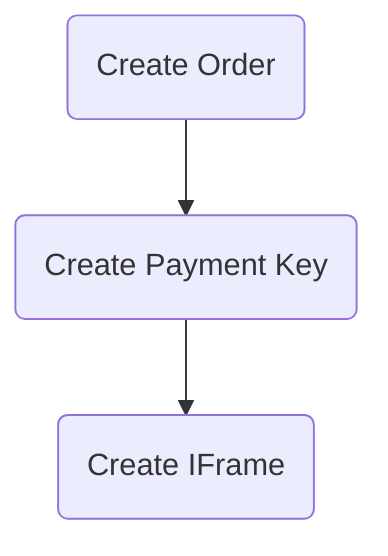
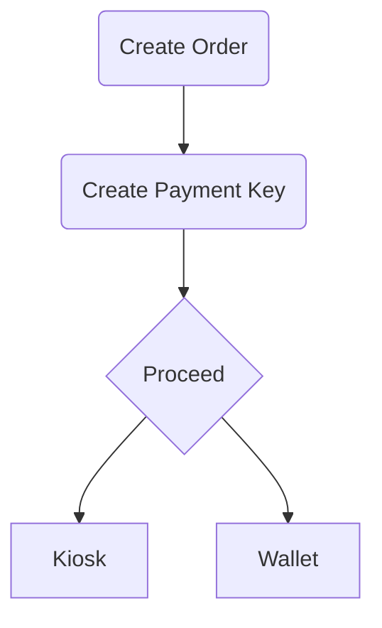

# Requirements

Before starting to use Accept APIs it needs to be configured with your account's secret keys which is
available in your [Accept Dashboard][accept-dashboard]. in `.env` Set the following variables:
```
ACCEPT_API_KEY=<YOUR API KEY>
ACCEPT_HMAC_SECRET=<YOUR HMAC SECRET>
```

After setting up your secret keys, now you will be able to use Accept API interfaces.


# Payment Flow

Payment Flow for [IFrame](#create-iframe-url) Payment


Payment Flow for `Kiosk`, `Wallet`, `Cash` Payment




# APIs

## Initialize `AcceptAPIClient`

```python
from paymob.accept import AcceptAPIClient

accept_api_client = AcceptAPIClient()
```

by initializing an object from `AcceptAPIClient` a TCP connection session is established with Paymob server and an `Auth Token` is automatically retrieved.

## Create Order

**Example**

```python
from paymob.accept import AcceptAPIClient
from paymob.accept.utils import AcceptUtils

accept_api_client = AcceptAPIClient()

mid_key = "<Type>" # MidKey is useful if you support multiple types of items.
identifier = "<Internal Order ID>"
merchant_order_id = AcceptUtils.generate_merchant_order_id(mid_key=mid_key, identifier=identifier)
amount_cents = 1000
currency = "EGP"

code, order_data, message = accept_api_client.create_order(
    merchant_order_id=merchant_order_id,
    amount_cents=amount_cents,
    currency=currency
)
```

**Parameters**

| Parameter | Required? | Default | Description |
| --- | --- | --- | --- |
| `merchant_order_id` | `Yes` | - |  Your Internal Order ID |
| `amount_cents` | `Yes` | - |  The price of the order in cents. |
| `currency` | `Yes` | - |  The currency related to this payment |
| `delivery_needed` | `No` | `False` | Set it to be true if your order needs to be delivered by Accept's product delivery services |
| `items` | `No` | `list` |  list of objects contains the contents of the order if it is existing, send it as empty array if it is not available. However, Mandatory for Souhoula and GET_GO payment methods |
| `shipping_data` | `No` | `dict` |  Mandatory if your order needs to be delivered, otherwise you can delete the whole object |
| `shipping_details` | `No` | `dict` |  Mandatory if your order needs to be delivered, otherwise you can delete the whole object |


## Get Order

**Example**

```python
from paymob.accept import AcceptAPIClient

accept_api_client = AcceptAPIClient()

order_id = "<Paymob Order Id>"
integration_id = "<Your Integration ID>"
code, order_data, message = accept_api_client.get_order(
    order_id=order_id,
)
```

**Parameters**

| Parameter | Required? | Default | Description |
| --- | --- | --- | --- |
| `order_id` | `Yes` | - | Order ID retrieved from [Create Order API](#create-order) |


## Create Payment Key

**Example**

```python
from paymob.accept import AcceptAPIClient

accept_api_client = AcceptAPIClient()

order_id = "<order_id>"
amount_cents = 1000
currency = "EGP"
billing_data = {}
integration_id = "<Your Integration ID>"
code, payment_key, message = accept_api_client.create_payment_key(
    order_id=order_id,
    amount_cents=amount_cents,
    currency=currency,
    billing_data=billing_data,
    integration_id=integration_id,
)

```

**Parameters**

| Parameter | Required? | Default | Description |
| --- | --- | --- | --- |
| `order_id` | `Yes` | - | Order ID retrieved from [Create Order API](#create-order) |
| `amount_cents` | `Yes` | - | The price should be paid through this payment channel with this payment key token |
| `currency` | `Yes` | - | The currency related to this payment |
| `billing_data` | `Yes` | `dict` | The billing data related to the customer related to this payment |
| `integration_id` | `Yes` | `False` | An identifier for the payment channel you want your customer to pay through |
| `card_token_key` | `No` | `str` | Card Token received from token callback if the user choices to save his card information for future payment |
| `expiration` | `No` | `int` | The expiration time of this payment token in seconds. (The maximum is 3600 seconds which is an hour) |
| `lock_order_when_paid` | `No` | `False` | A flag prevent this order to be paid again if it is paid |


## Wallet Payment

After creating the payment key, you may need to processed to `Mobile Wallets` payment, so you need to use the following API to get the `redirect URL`.

**Example**

```python
from paymob.accept import AcceptAPIClient

accept_api_client = AcceptAPIClient()

payment_key = "<Payment Key>"
identifier = "<Wallet Mobile Number>"
code, payment_data, message = accept_api_client.proceed_wallet_payment(
    payment_key=payment_key,
    identifier=identifier
)
```

**Parameters**

| Parameter | Required? | Default | Description |
| --- | --- | --- | --- |
| `payment_key` | `Yes` | - | Payment Key obtained from [Create Payment Key](#create-payment-key) |
| `identifier` | `Yes` | - | Wallet Mobile Number |


## Kiosk Payment

After creating the payment key, you may need to processed to `Kiosk` payment, so you need to use the following API to get the `bill_reference`.

**Example**

```python
from paymob.accept import AcceptAPIClient

accept_api_client = AcceptAPIClient()

payment_key = "<Payment Key>"
code, payment_data, message = accept_api_client.proceed_kiosk_payment(
    payment_key=payment_key,
)
```

**Parameters**

| Parameter | Required? | Description |
| --- | --- | --- |
| `payment_key` | `Yes` | Payment Key obtained from [Create Payment Key](#create-payment-key) |


## CASH Payment

After creating the payment key, you may need to processed to `Cash` payment, so you need to use the following API

**Example**

```python
from paymob.accept import AcceptAPIClient

accept_api_client = AcceptAPIClient()

payment_key = "<Payment Key>"
code, payment_data, message = accept_api_client.proceed_cash_payment(
    payment_key=payment_key,
)
```

**Parameters**

| Parameter | Required? | Description |
| --- | --- | --- |
| `payment_key` | `Yes` | Payment Key obtained from [Create Payment Key](#create-payment-key) |


## Card Token Payment

**Prerequisites:** Please ask your technical contact for a recurring payment setup, you should receive extra integration ID in your dashboard.

Now you've received your customer's card token, in order to perform recurring payments with this token, use the following API:

**Example**

```python
from paymob.accept import AcceptAPIClient

accept_api_client = AcceptAPIClient()

payment_key = "<Payment Key>"
code, payment_data, message = accept_api_client.proceed_card_token_payment(
    payment_key=payment_key,
    card_token=card_token
)
```

**Parameters**

| Parameter | Required? | Description |
| --- | --- | --- |
| `payment_key` | `Yes` | Payment Key obtained from [Create Payment Key](#create-payment-key) |
| `card_token` | `Yes` | Saved Card Token |


---

# HMAC Validation

Accept callbacks rely on HMAC authentication to verify Accept's identity and integrity of its data.
Every and each callback invoked from Accept's server-side has its own HMAC validation.

So, to authenticate the incoming HMAC all you've to do is to initialize an `HMAC` object and pass `incoming_hmac` and `callback_dict`, it will automatically calculates the HMAC from the Callback Dict and then compares the calculated one againest incoming HMAC, it will return `True` if the HMAC is verified, otherwise it will return `False`.

**Example**

```python
from paymob.accept import HMACValidator

incoming_hmac = "<HMAC sent in query params>"
callback_dict = "<Callback Dict>"
hmac_validator = HMACValidator(incoming_hmac=incoming_hmac, callback_dict=callback_dict
hmac_validator.is_valid # Returns True or False
)
```

**Parameters**

| Parameter | Required? | Description |
| --- | --- | --- |
| `incoming_hmac` | `Yes` | HMAC Sent in the Callback Query Params |
| `callback_dict` | `Yes` | Incoming Callback Dict (Request Body) |


---

# Utility Methods

We've implemented a few methods to help you during the integration/development process.

### - Generate Merchant Order ID

It is a method that builds Merchant Order ID with the following format
```
<MidKey>_<Internal Order ID>__<Current Time>
```

If your merchant supports multiple categories of items, this format will help you to refer this category using the `MidKey` Param.

**Example**

```python
from paymob.accept.utils import AcceptUtils

mid_key = "<Type>"
identifier = "<Internal Order ID>"
merchant_order_id = AcceptUtils.generate_merchant_order_id(
    mid_key=mid_key,
    identifier=identifier
)
```

**Parameters**

| Parameter | Required? | Description |
| --- | --- | --- |
| `mid_key` | `Yes` | Type |
| `identifier` | `Yes` | Internal Order ID |


### - Extract Mid key and Identifier

It allowes you to reverse the previous process

**Example**

```python
from paymob.accept.utils import AcceptUtils

merchant_order_id = "x_1__112233"
mid_key, identifier = AcceptUtils.extract_mid_key_and_identifier(
    merchant_order_id=merchant_order_id,
)
```

The `mid_key` will be `x` and `identifier` will be `1`


### - Create IFrame URL

if you want to proceed with any of the following payment methods:

- **Card**
- **Premium Card Payments**
- **Bank Installments**
- **ValU**
- **SOUHOOLA**
- **GET_GO**
- **Sympl**
- **Forsa**
- **NowPay**

you need to render its `IFrame` to continue the payment process, So all you need to do is to use the following utility method to create the `IFrame`

**Example**

```python
from paymob.accept.utils import AcceptUtils

iframe_id = "<Payment Method IFrame>"
payment_key = "<Payment Key>"
iframe = AcceptUtils.create_iframe_url(
    iframe_id=iframe_id,
    payment_key=payment_key
)
```


**Parameters**

| Parameter | Required? | Description |
| --- | --- | --- |
| `iframe_id` | `Yes` | IFrame ID of the payment method [Get it from here][accept-iframes] |
| `payment_key` | `Yes` | Payment Key obtained from [Create Payment Key](#create-payment-key) |


[accept-dashboard]: https://accept.paymob.com/portal2/en/home
[accept-iframes]: https://accept.paymob.com/portal2/en/iframes
